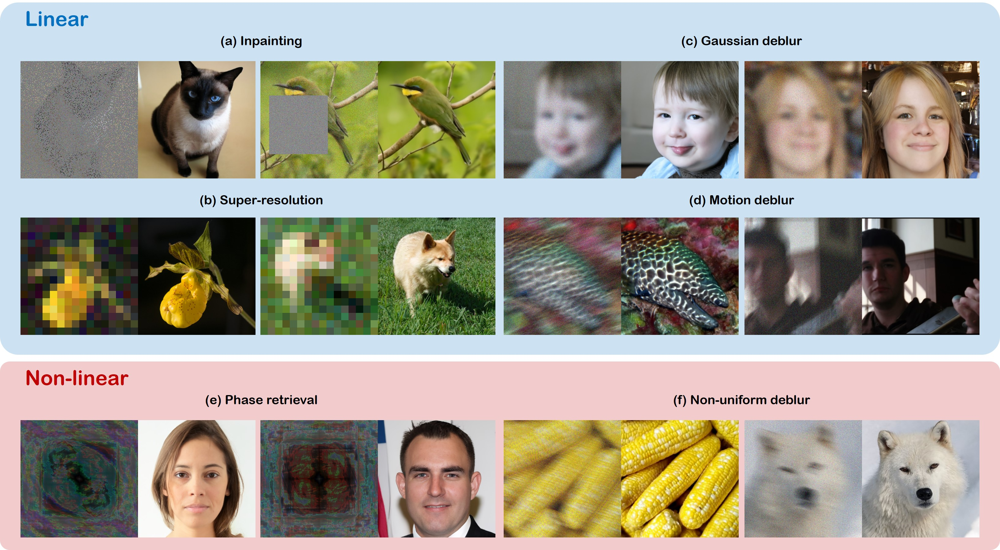

# Diffusion Posterior Sampling for General Noisy Inverse Problems (ICLR 2023 spotlight)


<!-- See more results in the [project-page](https://jeongsol-kim.github.io/dps-project-page) -->

## Abstract
In this work, we extend diffusion solvers to efficiently handle general noisy (non)linear inverse problems via the approximation of the posterior sampling. Interestingly, the resulting posterior sampling scheme is a blended version of the diffusion sampling with the manifold constrained gradient without strict measurement consistency projection step, yielding more desirable generative path in noisy settings compared to the previous studies.




## Prerequisites
- python 3.8

- pytorch 1.11.0

- CUDA 11.3.1

- nvidia-docker (if you use GPU in docker container)

It is okay to use lower version of CUDA with proper pytorch version.

Ex) CUDA 10.2 with pytorch 1.7.0

<br />

## Getting started 

### 1) Clone the repository

```
git clone https://github.com/DPS2022/diffusion-posterior-sampling

cd diffusion-posterior-sampling
```

<br />

### 2) Download pretrained checkpoint
From the [link](https://drive.google.com/drive/folders/1jElnRoFv7b31fG0v6pTSQkelbSX3xGZh?usp=sharing), download the checkpoint "ffhq_10m.pt" and paste it to ./models/
```
mkdir models
mv {DOWNLOAD_DIR}/ffqh_10m.pt ./models/
```
{DOWNLOAD_DIR} is the directory that you downloaded checkpoint to.

:speaker: Checkpoint for imagenet is uploaded.

<br />


### 3) Set environment
### [Option 1] Local environment setting

We use the external codes for motion-blurring and non-linear deblurring.

```
git clone https://github.com/VinAIResearch/blur-kernel-space-exploring bkse

git clone https://github.com/LeviBorodenko/motionblur motionblur
```

Install dependencies

```
conda create -n DPS python=3.8

conda activate DPS

pip install -r requirements.txt

pip install torch==1.11.0+cu113 torchvision==0.12.0+cu113 torchaudio==0.11.0 --extra-index-url https://download.pytorch.org/whl/cu113
```

<br />

### [Option 2] Build Docker image

Install docker engine, GPU driver and proper cuda before running the following commands.

Dockerfile already contains command to clone external codes. You don't have to clone them again.

--gpus=all is required to use local GPU device (Docker >= 19.03)

```
docker build -t dps-docker:latest .

docker run -it --rm --gpus=all dps-docker
```

<br />

### 4) Inference

```
python3 sample_condition.py \
--model_config=configs/model_config.yaml \
--diffusion_config=configs/diffusion_config.yaml \
--task_config={TASK-CONFIG};
```


:speaker: For imagenet, use configs/imagenet_model_config.yaml

<br />

## Possible task configurations

```
# Linear inverse problems
- configs/super_resolution_config.yaml
- configs/gaussian_deblur_config.yaml
- configs/motion_deblur_config.yaml
- configs/inpainting_config.yaml

# Non-linear inverse problems
- configs/nonlinear_deblur_config.yaml
- configs/phase_retrieval_config.yaml
```

### Structure of task configurations
You need to write your data directory at data.root. Default is ./data/samples which contains three sample images from FFHQ validation set.

```
conditioning:
    method: # check candidates in guided_diffusion/condition_methods.py
    params:
        scale: 0.5

data:
    name: ffhq
    root: ./data/samples/

measurement:
    operator:
        name: # check candidates in guided_diffusion/measurements.py

noise:
    name:   # gaussian or poisson
    sigma:  # if you use name: gaussian, set this.
    (rate:) # if you use name: poisson, set this.
```

## Citation
If you find our work interesting, please consider citing

```
@inproceedings{
chung2023diffusion,
title={Diffusion Posterior Sampling for General Noisy Inverse Problems},
author={Hyungjin Chung and Jeongsol Kim and Michael Thompson Mccann and Marc Louis Klasky and Jong Chul Ye},
booktitle={The Eleventh International Conference on Learning Representations },
year={2023},
url={https://openreview.net/forum?id=OnD9zGAGT0k}
}
```

